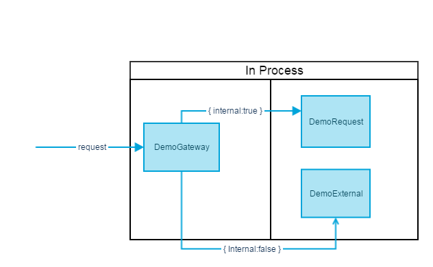

# ServiceStack.Request.Correlation
[](https://ci.appveyor.com/project/wwwlicious/servicestack-request-correlation/branch/master)
[](https://badge.fury.io/nu/ServiceStack.Request.Correlation)

A plugin for [ServiceStack](https://servicestack.net/) that creates a correlation id that allows requests to be tracked across multiple services.

If no correlation id is found one is created and appended to incoming `IRequest` object, both as a header and in the `IRequest.Items` collection. The correlation id is then added to outgoing `IResponse` object.

If a correlation id already exists then this is appended to the outgoing response object.

## Quick Start

Install the package [https://www.nuget.org/packages/ServiceStack.Request.Correlation](https://www.nuget.org/packages/ServiceStack.Request.Correlation/)
```bash
PM> Install-Package ServiceStack.Request.Correlation
```

The plugin is added like any other. By default it has no external dependencies that need to be provided.
```csharp
Plugins.Add(new RequestCorrelationFeature());
```

This will ensure an http header `x-mac-requestid` is added to requests with a unique id in every request/response.

### Customising
Both the http header name (default: "x-mac-requestid") and request id generation method (default: [RustFlakes](https://github.com/peschkaj/rustflakes)) can be customised:
```csharp
Plugins.Add(new RequestCorrelationFeature
{
    HeaderName = "x-my-custom-header",
    IdentityGenerator = new MyIdentityGenerator()
});

// public class MyIdentityGenerator : IIdentityGenerator { ... }
```
Where `IIdentityGenerator` has a single method that needs to be implemented. This method is called each time a request id is created:
```csharp
string GenerateIdentity();
```

## Demo
There is a demo project, DemoService, within the solution which will show some of the concepts. This is a console app that starts a self-hosted app host on http://127.0.0.1:8090 with the request correlation plugin setup using "x-my-requestId" as header name and a simple incrementing identity generator, and a sample ServiceGatewayFactory registered in DI for making external requests.

The "Postman Samples" folder contains a sample [Postman](https://www.getpostman.com/) collection containing test calls. Use the "Import" function in Postman to import this collection.

Sample calls are made to DemoGatewayService. If `{"internal":true}` then an inprocess request is made. If `{"internal":false}` then an external call is made (albeit to the same host). In both instances the correlation id travels to the downstream services (shown in header and body).



## Why?
When used with alongside a logging strategy it will enable tracing of requests across multiple services.

When working with distributed systems it becomes very valuable to track which services/systems an originating request has touched.

## How?
The plugin registers a [`PreRequestFilter`](https://github.com/ServiceStack/ServiceStack/wiki/Order-of-Operations) which checks the `IRequest` object for the existance of a correlation Id and creates one if there isn't one.

A [`GlobalResponseFilter`](https://github.com/ServiceStack/ServiceStack/wiki/Order-of-Operations) is used to append the correlation id to any outgoing `IResponse` objects.

### Internal and External calls
To support persisting the correlation id across external calls, on `AfterPluginsLoaded` the plugin checks to see if there is an `IServiceGatewayFactory` registered in the IoC container. If there is, and it is also an `ServiceGatewayFactoryBase`, then it registers a decorator, `ServiceGatewayFactoryBaseDecorator`, to add the correlation id to any outgoing external requests made via anything implementing `ServiceClientBase`, (e.g. `JsonServiceClient` or `JsvServiceClient`).

If the call is internal then the same `IRequest` object will be used so the correlation id will already be present.

## Limitations

### Identity Generation
The default `IIdentityGenerator` implementation uses [RustFlakes](https://github.com/peschkaj/rustflakes) for identity generation. This creates time-based sequential ids that can be generated from multiple sources without risking a collision. 

The correlation id stays the same across multiple service requests. One point that I would like to improve on is having a 'base' correlation id that can be augmented as it travels to different services to allow a [vector clock](https://en.wikipedia.org/wiki/Vector_clock), or similar, to be built.

### External Calls
Appending the correlation id to external calls is currently done via a decorator on registered `ServiceGatewayFactoryBase` but this feels a little clunky. I'll endeavour to have a cleaner method of ensuring the correlation id is appended to external, as well as internal, requests without having a dependency on certain items being registered within the IoC container.